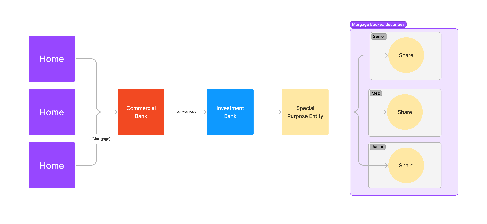

# Collapse of two Bear Stearns hedge funds
## Ryuichiro Suzuki
### ECN 347 Portfolio Management
---
# The main character
## Bear Stearns
- The Bear Stearns Companies was a NY based global investment bank founded in 1923.
- Prior to the financial collapse, Bear Stearns was the fifth-largest investment bank, with $18 billion in assets.
- It was a highly respected amongst the investment banks in the Wall st
([Chen](https://www.investopedia.com/terms/b/bear-stearns.asp), 2021)
- Bear Stearns had two hedge funds, the Bear Stearns High-Grade Structured Credit Fund and the Bear Stearns High-Grade Structured Credit Enhanced Leveraged Fund, among the wide range of financial services they provided. Those two hedge funds are the reason why they had to file for bankruptcy.

---
# When and what happened?
The fall down of the Bear Stearns occurred as one of the major events in the 2007 to 2008 global financial crisis, and they are one of the investment banks that went bankrupt as a result of it.

---
# When and what happened?
## MBS (mortgage backed securities) and CDO (collateralized debt obligation)

<small style="color: grey;">Structure of how mortgages were turned into an investment tool for hedge funds</small>

From [Kahn Academy](https://www.khanacademy.org/economics-finance-domain/core-finance/derivative-securities)

When the housing market, which was soaring until then, started to plummet in April 2007. The investment bank rapidly realized that the true danger posed by these hedge fund techniques was far higher than initially thought.

---
# Their practice and the shortcomings
- They purchased many CDOs that would pay an interest rate over the cost of borrowing
- Their strategy would work well if the credit markets remain relatively stable. However, the housing crisis caused MBS market to behave outside of the managers' initial expectations
- CDOs should be based on diverse pool of collaterals, but because of the housing market bubble, many were just pooled MBS, which made their investment vulnerable to the crisis in the housing market
- Also, they did not have ample liquid asset to cover for such extreme cases

---

# How was it resolved?
- Bear Stearns approached the Federal Reserve Bank of New York for a cash loan of $25 billion.
- Initially, FRBNY agreed to provide a $25 billion loan to Bear Stearns. However, they changed their mind later.
- When that was denied, JPMorgan Chase agreed to buy Bear Stearns for $2 a share, with the Federal Reserve guaranteeing $30 billion in mortgage-backed securities.
- The final price was ultimately raised to $10 a share, still a sharp drop for a company that had traded at $170 a year earlier.

---
# A lesson learned

One lesson from the collapse is that they should always hedge risks even for extreme cases. Also, they put put too much eggs in one basket. CDO would have been diverse but in reality, it was heavily mortgage based securities, which was not diverse enough.

---

# References
- Chen, J. (November, 2021 30). Bear Stearns Definition. Investopedia. Retrieved July 17, 2022, from https://www.investopedia.com/terms/b/bear-stearns.asp
- THe Investopedia. (2021, April 27). Dissecting the Bear Stearns Hedge Fund Collapse. Investopedia. Retrieved July 18, 2022, from https://www.investopedia.com/articles/07/bear-stearns-collapse.asp
- Kahn Academy. (n.d.). Mortgage-backed security. https://www.khanacademy.org/economics-finance-domain/core-finance/derivative-securities/mort-backed-secs-tut/v/mortgage-back-security-overview
- Tardi, C. (2022, March 8). Collateralized Debt Obligation (CDO) Definition. Investopedia. Retrieved July 18, 2022, from https://www.investopedia.com/terms/c/cdo.asp
